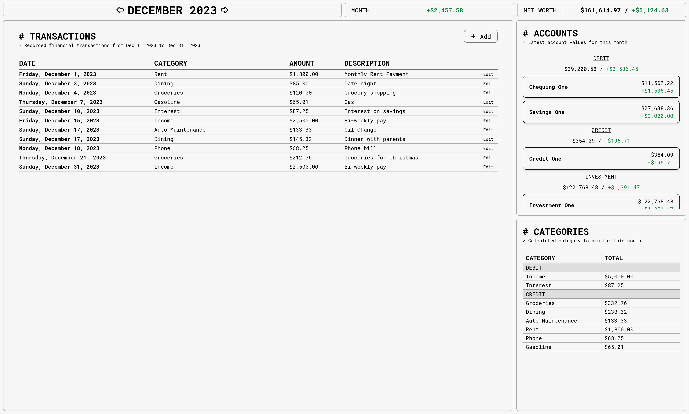
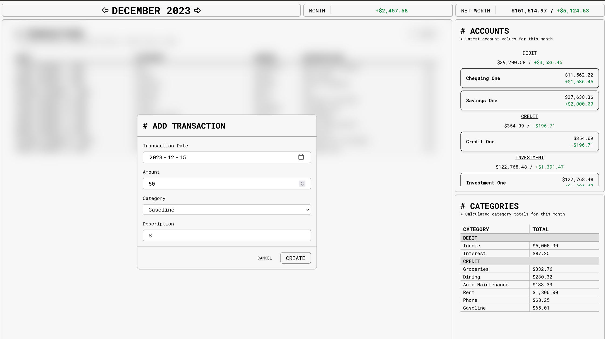

# MDEB Financial Tracking Ledger

## Motivation & Description

For years I have been keeping track of my monthly finances in an Excel spreadsheet. This includes:
- Manually copying transaction from my bank statements into the spreadsheet
- Categorizing transactions via a fixed list of categories
- Keeping track of monthly account values (debit + savings, credit and investments)
- Manually verifying that the debits and credits balance every month
- Copying and reseting the spreadsheet every month

The goal of this project was to "digitize" that bookkeeping process for my own personal use, and then eventually expand on the process with new budgeting, reporting and trend analysis capabilities.

The resulting product is a single page web application that can be used to keep track of personal monthly transactions, account values and spending per-category. The features and technology are described below:

## Features

- Record transactions (purchases, income, etc) on a month by month basis
- Categorize transactions in order to view monthly spending by category
    - This can also be used in the future to analyze spending habits and help with budgeting
- Keep track of debit, credit and investment accounts and their values on a month by month basis
    - This will allow for future trend analysis in investment accounts
- Display monthly profit/loss
- Display overall net worth

## Technology

NOTE - I used this project as an opportunity to get reaquainted with MongoDB (most of my professional experience is with Postgres) as well as learn Go (as opposed to Python - which I use professionally). The learning opportunity was a big inspiration for choosing the below technologies.

Database:
- MongoDB (https://www.mongodb.com/)

Backend:
- Go (https://go.dev/)
- Go-Chi (https://github.com/go-chi/chi)
- MongoDB Go Driver (https://www.mongodb.com/docs/drivers/go/current/)

Frontend:
- Vue (https://vuejs.org/)
- Vite (https://vitejs.dev/)
- TailwindCSS (https://tailwindcss.com/)
- Pinia (https://pinia.vuejs.org/)
- Tabler Icons (https://tabler-icons.io/)

## Development

This repository contains a backend API server written in Go and a frontend written in Vue (with Vite and TailwindCSS).
- The backend code can be found in the `server` directory, which has its own `README.md` that contains details on how to run and develop the backend
- The frontend code can be found in the `webapp` directory, which also has its own `README.md` that contains details on getting started with development

### Contributing

This is a personal project and as such I am not really looking for or expecting contributions. If you do stumble upon this repository you are welcome to fork it and use it for your own purposes. If the project ends up garnering some interest, then 

## Deployment

I have this project deployed on my home server using docker. You can find a `docker-compose.yml` file in the `docker` directory which is similar to the one I use for production.
- The only difference is that I have containers deployed to a private docker registry that I push to and pull from for deployment

## Future

Often with personal projects I find it is easy to blow out the scope, which ends up ultimately fizzling out my enthusiasm and eventually killing the project before it is finished. Therefore, the first goal of this project was to ONLY recreate everything I was already doing in a spreadsheet and not add any additional scope or features (despite having lots of ideas!).

Throughout the process of development, I have noticed some small bugs and improvements that can be made such as:
- Removing the edit button in Transactions list and instead just clicking on the row
- Quick add transactions using editable row rather than having to open a modal each time
- More efficient API requesting (I am currently requesting all accounts - even though some are not displayed)
- Using `nginx` instead of `http-server` for the containerized frontend

Phase 2 of the project will be adding some quality of life features that I didn't have but always wanted in the spreadsheet, such as:
- Quick copy account values from month to month
- Add a simple user login capability (for additional security)
- Adding new categories
    - Can currently be done using an API request
- Marking categories as inactive
- Adding new accounts
    - Can currently be done using an API request
- Marking accounts as inactive
- Tracking category spending over the year (not just for a single month)

Finally Phase 3 of the project will start exploring some new ideas like:
- Budgeting
- Automatic transaction creation using exports from my bank accounts
- Better data analysis
